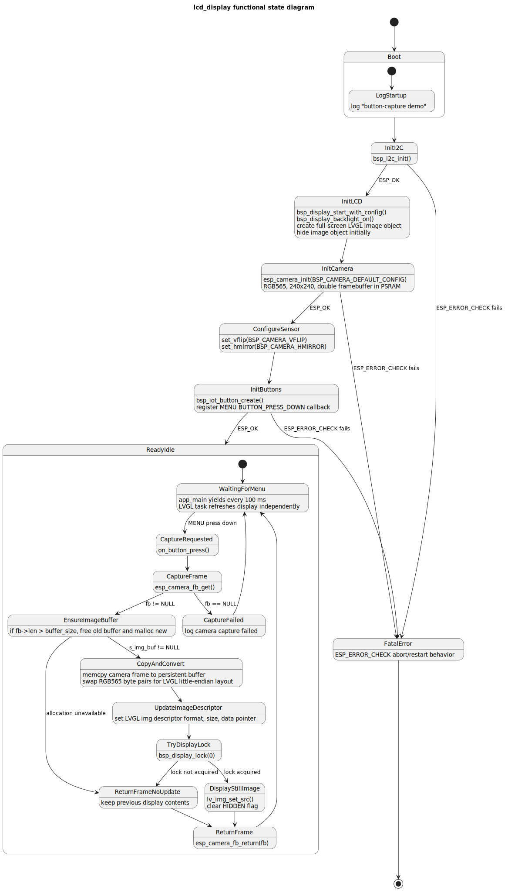

# lcd_display State Diagram

This document summarizes the functional behavior of the `lcd_display` ESP32-S3-EYE demo and links to the generated PlantUML state diagram.

## Diagram



- PlantUML source: [src/lcd_display_state.puml](src/lcd_display_state.puml)
- Rendered SVG: [out/lcd_display_state.svg](out/lcd_display_state.svg)

## PlantUML folder and rendering practice

The diagram files follow the VS Code PlantUML extension layout used for this workspace:

```text
docs/diagrams/
├── lcd_display_state.md
├── src/
│   └── lcd_display_state.puml
└── out/
    └── lcd_display_state.svg
```

Creation practice:

1. Create the PlantUML source folder before writing `.puml` files:

   ```sh
   mkdir -p docs/diagrams/src
   ```

2. Keep generated files out of the source folder and create a separate output folder:

   ```sh
   mkdir -p docs/diagrams/out
   ```

3. Save editable PlantUML source in `docs/diagrams/src/`.
4. Save rendered output in `docs/diagrams/out/`.

Encoding practice:

- Render from the exact saved `.puml` content, not from a stale previously generated URL.
- If server rendering returns an SVG containing `bad URL`, `DEFLATE`, or `HUFFMAN`, the failure is an encoded-URL problem, not necessarily a PlantUML syntax problem.
- Re-encode the current `.puml` source and use the canonical encoded URL returned by the encoder.
- Verify the final SVG does not contain PlantUML error text before treating it as a valid render.

## Functional requirements

1. Initialize the ESP32-S3-EYE board I2C bus before camera startup.
2. Start the BSP display with LVGL support, enable the LCD backlight, and create a hidden full-screen image widget.
3. Initialize the OV2640 camera with the BSP default 240x240 RGB565 configuration using PSRAM-backed double framebuffers.
4. Configure camera orientation with the board-defined vertical flip and horizontal mirror settings.
5. Initialize board buttons and register the MENU button press-down event as the capture trigger.
6. On each MENU press, capture one frame from the camera.
7. Copy the captured frame into persistent application-owned memory so the LVGL image remains valid after returning the camera framebuffer.
8. Swap RGB565 byte pairs before display because the camera frame byte order differs from LVGL's expected layout.
9. Update the LVGL image descriptor and reveal the full-screen image when the display lock is acquired.
10. Return the camera framebuffer after processing and wait for the next MENU press.

## Main runtime states

- **Boot**: Logs startup and begins hardware initialization.
- **InitI2C**: Initializes the shared I2C bus required by the camera.
- **InitLCD**: Starts LVGL display support and prepares the image widget.
- **InitCamera**: Starts the camera using BSP defaults.
- **ConfigureSensor**: Applies board camera orientation settings.
- **InitButtons**: Creates button handles and registers the MENU callback.
- **ReadyIdle**: Main steady state; the app yields while LVGL and button tasks run.
- **CaptureRequested**: MENU press callback captures and processes a still frame.
- **DisplayStillImage**: Updates the LVGL image object with the latest capture.
- **FatalError**: `ESP_ERROR_CHECK` abort path for initialization failures.
